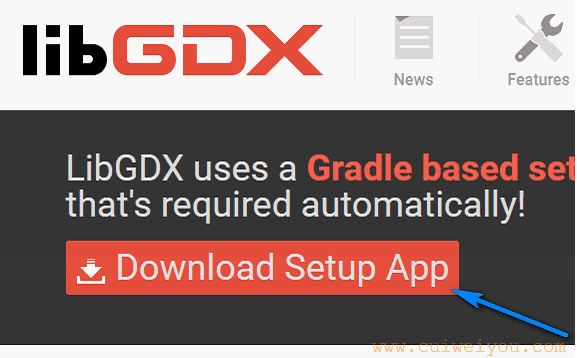
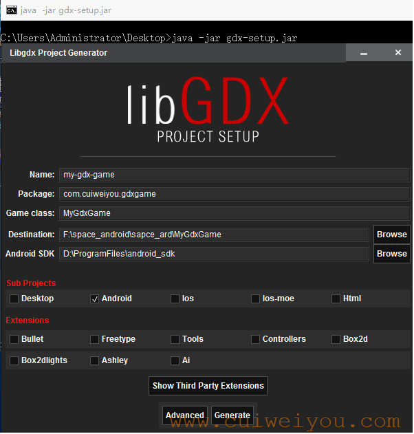
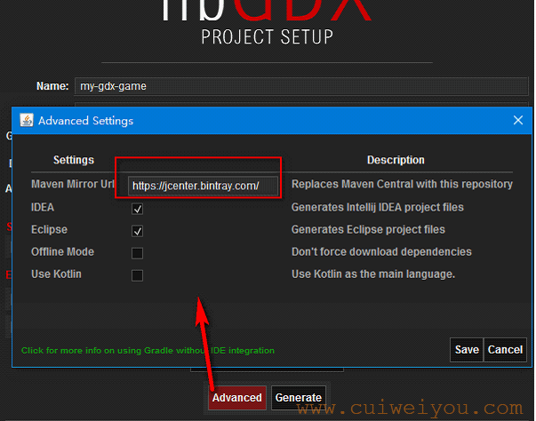
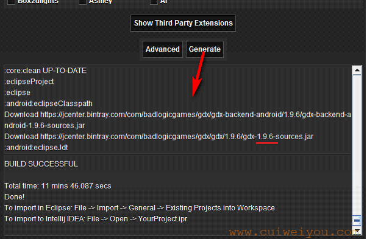
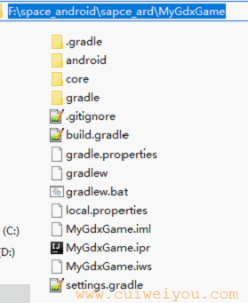
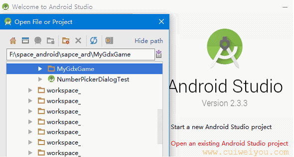
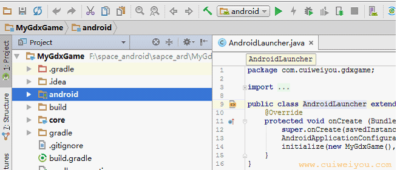
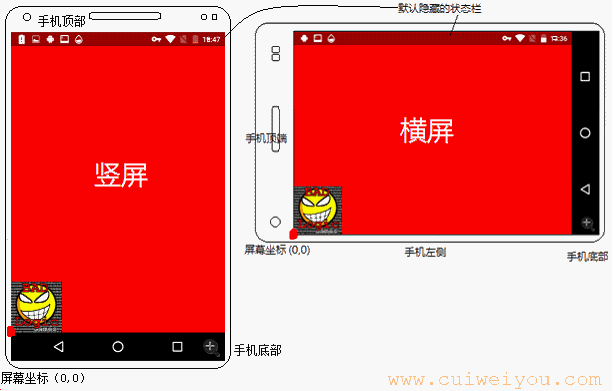

## 1.项目创建器

从这里下载gdx-setup.jar ：
[http://libgdx.badlogicgames.com/download.html](http://libgdx.badlogicgames.com/download.html) 
 
 
 
执行gdx-setup.jar ，Sub Projects中选择目标平台；Extensions中选择必要的扩展库。这些扩展库有的是独立的程序，有的是api包。
* Bullet：3D物理引擎
* Freetype：字体相关，处理中文
* Tools：游戏编码前使用的工具包
* Controllers：游戏手柄接口包
* Box2d：2D物理引擎
* Box2dlights：2D光照引擎
* Ashley：实体系统框架
* Ai：算法库

现在都保持留空。
 
 

## 2.设置资源仓库
 
这里选择了“IDEA”和“Eclipse”，可惜没有“AndroidStudio”格式。也看出目前的版本支持Kotlin了。

## 3.选择“Android”后生成
 

通过日志，得出本次下载到的最新gdx版本是1.9.6。
同时结果项目不是AndroidStudio的结构，是IDEA的。但不影响下一步。
 
 
 
在AS中导入刚刚生成的项目
 
 
 
## 4.AS中编译应用
根据相关配置文件得出，“android”module是入口模块，一些主要的依赖都按照java项目的方式配置。 
 
本例应用默认是横屏，可查看AndroidManifest.xml中的相关配置。 
 
 
 