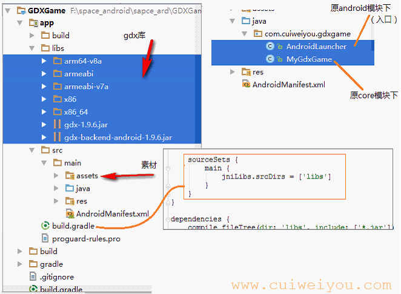
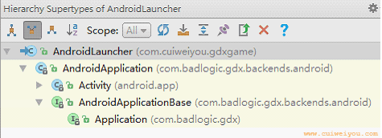
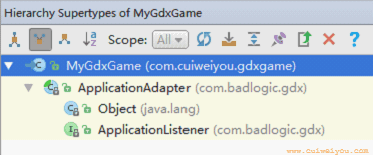

# 二.代码
自生成项目源码在AS中的使用有些许不便，现改为一个纯android项目<br/>
<br/>
现在看到的自动生成的代码只有2个java文件。<br/>

## 1.AndroidLauncher
这是本例的入口，游戏必要的载体。本质是个Activity，在gdx中称为场景（Screen）。一个游戏可有多个场景。
``` java
/** *AndroidApplication已经将Activity的生命周期都重写过了 */ 
public class AndroidLauncher extends AndroidApplication {
    @Override
    protected void onCreate(Bundle savedInstanceState) {
        super.onCreate(savedInstanceState);
        Log.e("ard", "Activity onCreate");

        AndroidApplicationConfiguration config = new AndroidApplicationConfiguration();
        initialize(new MyGdxGame(), config);
    }

    @Override
    protected void onResume() {
        super.onResume();
        Log.e("ard", "Activity onResume");
    }

    @Override
    protected void onPause() {
        super.onPause();
        Log.e("ard", "Activity onPause");
    }

    @Override
    protected void onDestroy() {
        super.onDestroy();
        Log.e("ard", "Activity onDestroy");
    }
}
```
<br/>
<br/>
此入口继承自gdx的AndroidApplication（AA），而AA继承自安卓传统Activity。AA实现了gdx的AndroidApplicationBase（AAB），AAB这个接口又继承自gdx的Application接口。<br/>
以上类主要定义与系统、日志、IO、进程、消息等相关的功能。

## 2.AndroidApplicationConfiguration 
　　查看类结构会发现这就是个POJO，望文生义，即一些初始化的配置参数。<br/>
　　包括rgba色深，每种颜色深度是2的n次幂，默认5/6/5/0。
* depth、stencil：缓冲深度、位数，默认0。
* numSamples：CSAA/MSAA渲染级别，取值int 0-2，默认0。
* useAccelerometer：使用加速，默认true。
* useGyroscope：是否使用陀螺仪，默认false；
* useCompass：是否使用指南针，默认true。
* touchSleepTime：touch事件发生后下一次响应延迟毫秒数，默认0。
* useWakelock：在运行时是否保持屏幕亮度和亮度，默认false。底层基于FLAG_KEEP_SCREEN_ON。
* hideStatusBar：是否隐藏状态栏。api<=14默认false，>14默认true。
* disableAudio是否开启音频支持，默认false。
* maxSimultaneousSounds：最多可同时播放几个音频，默认16。参考gdx的Sound和android的SoundPool。
* resolutionStrategy：配置GLSurfaceView的像素操作策略，默认new一个FillResolutionStrategy。
* getTouchEventsForLiveWallpaper：如果应用使用了动态壁纸特征，是否接收全部类型的touch事件，默认false。一般只接收点击和滑动。
* useImmersiveMode：是否使用4.4的沉浸模式（沉浸式状态栏），默认false。
* useGL30：是否优先启用ES3.x版本，默认false。如果不支持3.x，则自动切换为2.x。
* useGLSurfaceView20API18：是否在2.3及更早版本开启GLSurfaceView20API18，默认false。<br/>
　　<br/>
　　有时程序运行后，会自动根据系统/硬件对默认配置做出优化调整。<br/>

## 3.MyGdxGame
这个类中定义了img和batch。img用以加载一张图片，batch使之呈现。
``` java
**
 * ApplicationAdapter实现了ApplicationListener的完整生命周期<br/>
 * 这里继承ApplicationAdapter只重写必要的功能即可
 */
public class MyGdxGame extends ApplicationAdapter {
    // 脚本精灵。类似View的Canvas
    SpriteBatch batch;
    Texture img;

    // 启动应用执行一次
    @Override
    public void create () {
        Log.e("ard", "应用监听器 1, create");

        batch = new SpriteBatch();
        img = new Texture("badlogic.jpg"); // 直接读取assets下的图片
    }

    // create之后，resume之后(横竖屏切换、从后台回来时）执行
    @Override
    public void resize(int width, int height) {
        super.resize(width, height);

        // 如果是横屏，那么这个width就是手机屏幕的高度，height是手机屏幕的宽。竖屏时则和屏幕宽高对应。
        Log.e("ard", "应用监听器 resize, width:" + width + ", height:" + height);
    }

    // 游戏运行状态。如同View的onDraw，按时钟频率循环执行。进入后台自动停止（进入pause状态）
    @Override
    public void render () {
        Log.e("ard", "应用监听器 2, 5, render");

        Gdx.gl.glClearColor(1, 0, 0, 1);
        Gdx.gl.glClear(GL20.GL_COLOR_BUFFER_BIT);
        batch.begin();
        // 和resize方法的坐标一致，0,0总是指屏幕左下角
        batch.draw(img, 0, 0); // 绘制位置px，(0,0)为[当前正常观看的]左下角
        batch.end();
    }

    // 进入后台执行
    @Override
    public void pause() {
        super.pause();

        Log.e("ard", "应用监听器 3, 6, pause");
    }

    // 从后台返回执行。然后resize，然后render
    @Override
    public void resume() {
        super.resume();

        Log.e("ard", "应用监听器 4, resume");
    }

    // 游戏退出执行。首先进入pause状态，才dispose
    @Override
    public void dispose () {
        Log.e("ard", "应用监听器 7, dispose");

        batch.dispose();
        img.dispose();
    }
}
```

<br/>
<br/>
MyGdxGame继承自gdx的ApplicationAdapter（AAdapter），AAdapter是个抽象类（没有遗留抽象方法），它实现ApplicationListener（AL）接口。AL仅声明了游戏本身的6个生命周期方法，且都被AAdapter实现了。<br/>
比起旧版本中间多了个AAdapter的好处就是，现在只重写render和dispose就可以了；否则得重写全部6个方法。
<br/>
## 4.生命周期
以下所示的生命周期日志，基于上文的条件，只有一个Activity。

``` bat
 E/ard: Activity onCreate
 E/ard: Activity onResume
 E/ard: 应用监听器 1, create
 E/ard: 应用监听器 resize, width:1776, height:1080
 E/ard: 应用监听器 2, 5, render
 E/ard: 应用监听器 2, 5, ... 不断执行
 E/ard: 应用监听器 2, 5, render
 E/ard: 应用监听器 3, 6, pause                          // 点击Home键后发生
 E/ard: Activity onPause
 E/ard: Activity onResume                             // 从最近项目启动后发生
 E/ard: 应用监听器 4, resume
 E/ard: 应用监听器 resize, width:1776, height:1080
 E/ard: 应用监听器 2, 5, render
 E/ard: 应用监听器 2, 5, ... 不断执行
 E/ard: 应用监听器 2, 5, render
 E/ard: 应用监听器 3, 6, pause
 E/ard: 应用监听器 7, dispose                          // 双击返回键后发生
 E/ard: Activity onPause
 E/ard: Activity onDestroy                           // 程序退出
```
游戏体的生命周期和Android组件的生命周期非常一致。开发中差不多可以忽略Android本身的特性。
<br/>
<br/>


