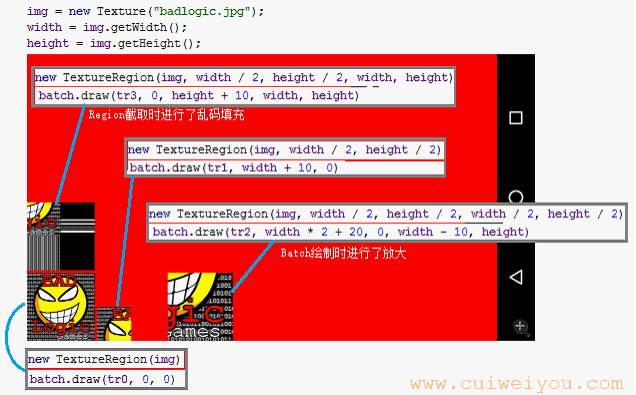
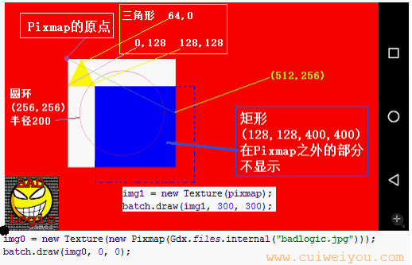
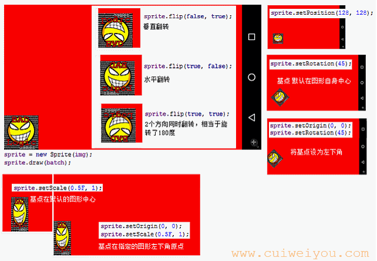
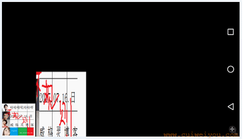
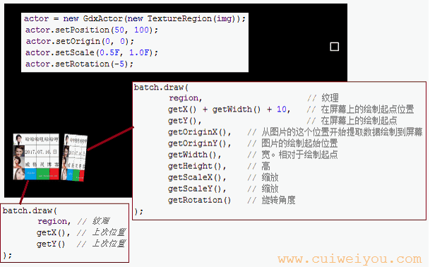
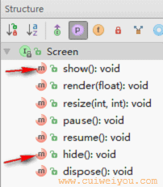
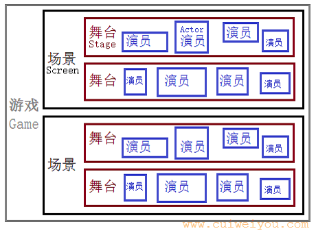

# 1.可视元素
## 1）纹理（Texture）
　　这个类在上面已经见过了。Texture实现了Disposable接口，需要在及时调用dispose方法回收资源。Disposable的实现类有很多，都需要此操作。

## 2）区域纹理（TextureRegion）
TextureRegion是对Texture的封装。个人理解是个“遮罩”。
``` java
public class GDXGame extends ApplicationAdapter {
    // 脚本精灵
    SpriteBatch batch;
    Texture img;
    TextureRegion tr0, tr1, tr2, tr3;
    private int width;
    private int height;

    @Override
    public void create() {
        batch = new SpriteBatch();
        img = new Texture("badlogic.jpg");

        width = img.getWidth();
        height = img.getHeight();

        // 保持原Texture的状态
        tr0 = new TextureRegion(img);
        // 从Texture自身的左上角原点(0,0)，截取半宽, 半高的图像。平分四份，去左上角一份
        tr1 = new TextureRegion(img, width / 2, height / 2);
        // 从Texture自身的(半宽,半高)，截取半宽, 半高的图像。平分四份，取右下角一块
        tr2 = new TextureRegion(img, width / 2, height / 2, width / 2, height / 2);
        // 从Texture自身的(半宽,半高)，截取原宽高的图像。如果截取到的宽高小于目标宽高时以乱码补充
        tr3 = new TextureRegion(img, width / 2, height / 2, width, height);
    }

    @Override
    public void render() {
        Gdx.gl.glClearColor(1, 0, 0, 1);
        Gdx.gl.glClear(GL20.GL_COLOR_BUFFER_BIT);

        batch.begin();
        batch.draw(tr0, 0, 0);                              // 从屏幕左下角原点(0,0)绘制第一个区域纹理-原始图片
        batch.draw(tr1, width + 10, 0);                     // 从屏幕的指定(x,y)位置绘制。绘制大小为纹理的大小
        batch.draw(tr2, width * 2 + 20, 0, width - 10, height);  // 从屏幕的指定(x,y)位置绘制。绘制大小为指定的宽高(w,h)
        batch.draw(tr3, 0, height + 10, width, height);
        batch.end();
    }

    @Override
    public void dispose() {
        batch.dispose();
        img.dispose();

        tr0.getTexture().dispose();
        tr1.getTexture().dispose();
        tr2.getTexture().dispose();
        tr3.getTexture().dispose();
    }
}
```

<br/>
<br/>

## 3）映射图（Pixmap）
这个类只是在内存中构建一个图形。如果要显示，还需要Texture的包装。
``` java
public class GDXGame extends ApplicationAdapter {
    SpriteBatch batch;
    Texture img0, img1;
    private Pixmap pixmap;

    @Override
    public void create() {
        batch = new SpriteBatch();

        // 直接从assets里加载一张图片到Pixmap
        img0 = new Texture(new Pixmap(Gdx.files.internal("badlogic.jpg")));

        // 创建指定宽高的Pixmap（width, height, 颜色格式）
        pixmap = new Pixmap(512, 512, Pixmap.Format.RGBA8888);

        /** 【【 Pixmap自身原点在左上角 】】 **/

        // 设置绘图颜色(r,g,b,a)为白色。取值float，0-1
        pixmap.setColor(1, 1, 1, 1);
        pixmap.fill();//填充整个图形为当前设置的颜色

        pixmap.setColor(gdx.graphics.Color.BLUE);
        // 绘制矩形（x, y, width, height）。左上角在(128, 128)相对于Pixmap原点, 宽-向右,高-向下为400
        pixmap.fillRectangle(128, 128, 400, 400); // fill方法填充图形。右下角超出了Pixmap则不显示

        pixmap.setColor(Color.YELLOW);
        // 绘制三角形（x1,y1, x2,y2, x3,y3）, 三个点都基于Pixmap的原点
        pixmap.fillTriangle(64, 0, 0, 128, 128, 128);

        pixmap.setColor(1, 0, 0, 1);
        // 绘制空心圆(x, y, radius)，xy为相对自身原点圆心的位置
        pixmap.drawCircle(256, 256, 200); // draw方法仅绘制边线

        pixmap.setColor(Color.GREEN);
        // 绘制线段（startX, startY, toX, toY）。这里从Pixmap自身的 (0, 0) 到 (512, 256)
        pixmap.drawLine(0, 0, 512, 256);

        /* 后绘制的会遮挡先绘制的 */

        img1 = new Texture(pixmap); // 转换成纹理

        // pixmap 已不再需要用到, 释放资源
        pixmap.dispose();
    }

    @Override
    public void render() {
        Gdx.gl.glClearColor(1, 0, 0, 1);
        Gdx.gl.glClear(GL20.GL_COLOR_BUFFER_BIT);

        batch.begin();
        batch.draw(img0, 0, 0);         // 绘制加载的图片
        batch.draw(img1, 300, 300);     // 绘制自定义图形
        batch.end();
    }

    @Override
    public void dispose() {
        batch.dispose();
        img0.dispose();
        img1.dispose();
    }
}
```
<br/>
<br/>

## 4）精灵（Sprite）
Sprite是TextureRegion的子类，是对TextureRegion的增强。
``` java
public class GDXGame extends ApplicationAdapter {
    private SpriteBatch batch;
    private Texture img;
    private Sprite sprite;

    @Override
    public void create() {
        batch = new SpriteBatch();
        img = new Texture("badlogic.jpg");

        // 使用纹理创建精灵, 精灵宽高为该纹理的宽高
        sprite = new Sprite(img);

        // 设置精灵相对于父对象的位置。这里即相对于屏幕原点
        sprite.setPosition(128, 128);

        // 设置Rotation旋转和Scale缩放的基点为Sprite自身的左下角-原点, 默认在宽高的一半, 即图片中心
        sprite.setOrigin(0, 0);

        // 设置精灵的旋转角度, 逆时针方向为正
        sprite.setRotation(45);

        // 设置精灵的x和y轴方向的缩放比, 均缩小为原来的 1/2
        sprite.setScale(0.5f, 0.5f); // 1仍是原大小，没有意义

        // 设置精灵（是否左右翻转, 是否垂直翻转）
        sprite.flip(true, true);
    }

    @Override
    public void render() {
        Gdx.gl.glClearColor(1, 0, 0, 1);
        Gdx.gl.glClear(GL20.GL_COLOR_BUFFER_BIT);

        batch.begin();

        // 主动绘制
        sprite.draw(batch);

        batch.end();
    }

    @Override
    public void dispose() {
        batch.dispose();
        img.dispose();
    }
}
```
<br/>
<br/>

### 5）动画（Animation）
　　和U3D/Cocos一样，gdx也使用了如图这种2d动画图片素材。图片的宽高可以不规则，但建议是2的n次幂。

<br/>

　　素材的形式不限于上图所示。因为gdx只接收一维数组作为关键帧序列。所以无论素材是否规则，最终都须整理为一个数组。
　　上图一般的播放循序：
首先播放(行1,列1)，然后(行1,列2)，(行1,列3)，……；
然后(行2,列1)，(行2,列2)，(行2,列3)，……
依次到(N行,N列)。

<br/>

　　也可以制作只有一行的素材，如果帧很多，也是个考验耐心的工作。
``` java
public class GDXGame extends ApplicationAdapter {
    private SpriteBatch batch;
    private Texture img;
    private Animation<TextureRegion> animation;
    private float duration;
    private TextureRegion currentFrame;

    @Override
    public void create() {
        batch = new SpriteBatch();
        img = new Texture("anmi2.png"); // 直接加载assets中的动画图片素材

        int frameRows = 4;  // 素材中幁的行数
        int frameCols = 4;  // 列数

        int cellWidth = img.getWidth() / frameCols;     // 帧的宽
        int cellHeight = img.getHeight() / frameRows;   // 帧的高

        // 按宽高分解素材为帧的数组
        TextureRegion[][] cellRegions = TextureRegion.split(img, cellWidth, cellHeight);

        // 把二维数组变为一维数组。也可以放到一个gdx的Array中
        TextureRegion[] frames = new TextureRegion[frameRows * frameCols];
        int index = 0;
        for (int row = 0; row < frameRows; row++) { // 行
            for (int col = 0; col < frameCols; col++) { // 列
                frames[index++] = cellRegions[row][col];
            }
        }

        // 创建动画实例（每帧时长秒，帧集合）
        animation = new com.badlogic.gdx.graphics.g2d.Animation<TextureRegion>(0.5f, frames);

        /*
         * 设置播放模式:
         *
         * Animation.PlayMode.NORMAL: 正常播放一次（默认）
         * Animation.PlayMode.REVERSED: 倒序播放一次
         *
         * Animation.PlayMode.LOOP: 正常循环播放
         * Animation.PlayMode.LOOP_REVERSED: 倒序循环播放
         *
         * Animation.PlayMode.LOOP_RANDOM: 随机循环播放
         * Animation.PlayMode.LOOP_PINGPONG: 开关式（先正序再倒序）循环播放
         */
        animation.setPlayMode(Animation.PlayMode.LOOP);

        // 每帧时长，单位秒
        animation.setFrameDuration(1);
    }

    @Override
    public void render() {
        Gdx.gl.glClearColor(1, 0, 0, 1);
        Gdx.gl.glClear(GL20.GL_COLOR_BUFFER_BIT);

        float graphicsDeltaTime = Gdx.graphics.getDeltaTime(); // 相对上一帧的耗时，秒

        // 动画已经播放时长
        duration += graphicsDeltaTime;

        if (duration >= Float.MAX_VALUE)
            duration = 0;

        // 根据播放模式和播放时长获取当前关键帧。即此刻应该播放哪一帧
        currentFrame = animation.getKeyFrame(duration);

        batch.begin();

        // 绘制当前关键帧
        batch.draw(currentFrame, 500, 500, 300, 300);

        batch.end();
    }

    @Override
    public void dispose() {
        batch.dispose();
        img.dispose();
    }
}
```
<br/>
## 6）精灵脚本/纹理画布（SpriteBatch）
上面的例子都没少了这个类。
``` java
public void render() {
    Gdx.gl.glClearColor(0, 0, 0, 1);
    Gdx.gl.glClear(GL20.GL_COLOR_BUFFER_BIT);

    batch.begin();
    batch.draw(img, 0, 0);

    /*
     * @param x 绘制起点。相对于屏幕原点
     * @param y 绘制起点。相对于屏幕原点
     * @param originX 绘制起点/基点/原点。相对于屏幕原点的偏移
     * @param originY 绘制起点/基点/原点。相对于屏幕原点的偏移
     * @param width 绘制宽
     * @param height 目标高
     * @param scaleX x轴的缩放倍数
     * @param scaleY y轴的缩放倍数
     * @param rotation 旋转角度
     * @param srcX 取原素材纹理x坐标，相对于纹理自身左上角原点
     * @param srcY 取原素材纹理y坐标，相对于纹理自身左上角原点
     * @param srcWidth 取原素材纹理指定宽度。取到的宽小于绘制宽度则拉伸
     * @param srcHeight 取原素材纹理指定高度。取到的会根据目标绘制的自动缩放
     * @param flipX 是否水平翻转
     * @param flipY 是否垂直翻转 */
    batch.draw (img, width + 10, 0, 5, 10, width, height, 1.5f, 2, 0, 50, 50, width - 20, height / 2, false, false);

    batch.end();
}
```
<br/>
<br/>
<br/>

# 2.演员Actor
　　之前的Texture、TextureRegion、Sprite、Animation、Pixmap都是对图片的“描述”。到这里，Actor才进入游戏Game的范畴。
<br/>
　　Actor一般需要自己做2个工作：act和draw。但只有draw方法是空的，所以自定义演员一定重写此方法。
　　act就是读剧本，揣摩动作、Pose、表情等；是draw的准备工作。
　　draw则是表演，是观众实实在在看到的。
``` java
public class GDXGame extends ApplicationAdapter {
    private SpriteBatch batch;
    private Texture img;
    private GdxActor actor;

    @Override
    public void create() {
        batch = new SpriteBatch();
        img = new Texture("anmi.png");

        // 创建演员
        actor = new GdxActor(new TextureRegion(img));

        // 设置演员相对于父对象的坐标。本例即相对于屏幕原点
        actor.setPosition(50, 100); // 或者 setX(), setY() 分开设置

        // 设置演员的旋转和缩放支点为演员自身的左下角。同Sprite
        actor.setOrigin(0, 0);

        // 设置演员缩放比, X 轴方向缩小到 0.5 倍, Y 轴方向保持不变
        actor.setScale(0.5F, 1.0F);

        // 顺时针旋转 5 度
        actor.setRotation(-5);
    }

    @Override
    public void render() {
        Gdx.gl.glClearColor(0, 0, 0, 1);
        Gdx.gl.glClear(GL20.GL_COLOR_BUFFER_BIT);


        batch.begin();

        // 读剧本。更新演员逻辑
        actor.act(Gdx.graphics.getDeltaTime()); // 如果没有剧本，完全可以即兴表演嘛
        // 表演。绘制演员
        actor.draw(batch, 1.0F); // 如果没有剧本，完全可以即兴表演嘛 —— 薛之谦

        batch.end();
    }

    @Override
    public void dispose() {
        batch.dispose();
        img.dispose();
    }
}

/**
 * 发现一个演员
 */
class GdxActor extends Actor {

    private TextureRegion region;

    public GdxActor(TextureRegion region) {
        super();
        this.region = region;

        // 将演员的宽高设置为纹理区域的宽高（宽高默认为 0，因此不可见）
        setSize(this.region.getRegionWidth(), this.region.getRegionHeight());
    }

    /**
     * 逻辑处理。演员的剧本，什么动作，什么表情，什么台词
     * @param delta 相对上一帧的耗时。上一帧到当前帧的时间间隔。单位: 秒
     */
    @Override
    public void act(float delta) {
        super.act(delta);
        // 剧本。一般没有剧本
    }

    /**
     * 绘制演员
     *
     * @param batch       脚本/纹理画布
     * @param parentAlpha 父节点的透明度
     */
    @Override
    public void draw(Batch batch, float parentAlpha) {
        super.draw(batch, parentAlpha);

        // 如果纹理为null 或者 演员不可见, 则直接不绘制
        if (region == null || !isVisible()) {
            return;
        }

        /*
         * 绘制纹理区域
         * batch的draw方法有很多重载
         */
        batch.draw(
                region, // 纹理
                getX(), // 绘制起点位置
                getY()  // 绘制起点
        );

        /*
         * 绘制纹理区域
         * batch的draw方法有很多重载
         */
        batch.draw(
                region,                     // 纹理
                getX() + getWidth() + 10,   // 在屏幕上的绘制起点位置
                getY(),                     // 在屏幕上的绘制起点
                getOriginX(),   // 从图片的这个位置开始提取数据绘制到屏幕
                getOriginY(),   // 图片的绘制起始位置
                getWidth() * 2, // 宽。相对于绘制起点
                getHeight(),    // 高
                getScaleX(),    // 缩放
                getScaleY(),    // 缩放
                getRotation()   // 旋转角度
        );
    }

}
```
<br/>
<br/>
<br/>

# 3.导演/舞台Stage
　　舞台Stage是演员Actor“表演”的地方，是一个包含不同层次演员的 2D 场景。<br/>
　　Stage有成员Viewport视窗-镜头（处理画面整体缩放/屏幕适配），继承自InputAdapter可对事件（触屏）处理、将事件分发。<br/>
　　Stage默认有个跟班Group-也可以指定给他一个-来管理全部的Actor；默认有个Batch-脚本-来执行draw，也可以指定。Stage中增加Actor实际是加入Group中，Stage将Batch指定为Group的batch，Group对Actor喊“开拍”时，将batch指定给Actor，回到上面一节，Actor中我们自己实现的draw方法里，去使用这个batch。<br/>
<br/>
　　Stage使用的坐标原点是从屏幕左下方开始。<br/>
<br/>
　　常用方法：
* float getWidth()： 获取舞台的宽度
* float getHeight()： 获取舞台的高度
* void act(float delta)： 更新舞台逻辑，并批处理舞台中的演员（自动逐个调用演员的 act() 方法更新演员逻辑）
* void draw()： 绘制舞台，并批处理舞台中的演员（自动逐个调用演员的 draw() 方法绘制演员）
* void dispose() : 释放舞台中的所有资源
* boolean addListener(EventListener listener)： 添加事件监听到舞台
* boolean removeListener(EventListener listener)： 移除监听器
* void addActor(Actor actor)： 增加一个演员到舞台中
* void clear()： 移除舞台中的所有演员
* Array<Actor> getActors()： 获取舞台中的所有演员
* Group getRoot()： 获取舞台中维护所有演员的演员组
<br/>
示例代码，Actor的定义看上一节。
``` java
public class GDXGame extends ApplicationAdapter {
    private Texture img;
    private GdxActor actor;
    private Stage stage;

    @Override
    public void create() {
        img = new Texture("anmi.png");

        actor = new GdxActor(new TextureRegion(img));

        stage = new Stage();
        stage.addActor(actor);
    }

    @Override
    public void render() {
        Gdx.gl.glClearColor(0, 0, 0, 1);
        Gdx.gl.glClear(GL20.GL_COLOR_BUFFER_BIT);

        stage.act();
        stage.draw();
    }

    @Override
    public void dispose() {
        stage.dispose();
        img.dispose();
    }
}
```
<br/>

## 1）演员和舞台的事件
LibGDX处理输入捕获的类为com.badlogic.gdx.Input，实例为Gdx.input。Input中接收一个InputProcessor接口实例。Stage继承InputAdapter，继而实现了InputProcess。
<br/>
Input捕获的事件可交由EventListener进行处理。常用实现类有：<br/>
（1）InputListener：输入监听器。屏幕上有3个事件。<br/>
touchDown()：手指按下<br/>
touchDragged()：手指按下后在屏幕上滑动<br/>
touchUp()：手指抬起，离开屏幕<br/>
（2）ClickListener：点击监听器。只有一个事件。<br/>
clicked()：被点击<br/>
``` java
public class GDXGame extends ApplicationAdapter {
    private Texture img;
    private GdxActor actor;
    private Stage stage;
    private ActorClickListener clickListener;
    private StageTouchListener touchListener;

    @Override
    public void create() {
        img = new Texture("anmi.png");

        actor = new GdxActor(new TextureRegion(img));
        actor.setName("Vigiles");
        actor.setPosition(260, 240);

        stage = new Stage();
        stage.addActor(actor);

        // 首先Stage接收事件，然后进一步下发。这个是必须的
        Gdx.input.setInputProcessor(stage);

        // 舞台的事件处理器/监听器
        touchListener = new StageTouchListener();
        stage.addListener(touchListener);

        // 给演员添加一个 点击 监听器
        clickListener = new ActorClickListener();
        actor.addListener(clickListener);
    }

    @Override
    public void render() {
        Gdx.gl.glClearColor(0, 0, 0, 1);
        Gdx.gl.glClear(GL20.GL_COLOR_BUFFER_BIT);

        stage.act();
        stage.draw();
    }

    @Override
    public void dispose() {
        stage.removeListener(touchListener);
        actor.removeListener(clickListener);

        stage.dispose();
        img.dispose();
    }

    /**
     * Touch事件
     * InputListener中的事件处理方法都不是必须重写的
     * 选择需要的重写即可
     */
    private class StageTouchListener extends InputListener {

        /** 按下。button是鼠标左右键
         *
         * @param pointer
         *      按下手指的ID, 用于多点触控时辨别按下的是第几个手指,
         *      一般情况下第一只手指按下时 pointer 为 0, 手指未抬起前又有一只手指按下, 则后按下的手指 pointer 为 1。
         *      同一只手指的 按下（touchDown）, 拖动（touchDragged）, 抬起（touchUp）属于同一次序列动作（pointer 值相同）,
         *      pointer 的值在 按下 时被确定, 之后这只手指产生的的 拖动 和 抬起 动作将会把该已确定的 pointer 值传递给其事件方法
         *      touchDragged() 和 touchUp() 方法。
         * @return
         *      返回 true: 表示当前对象需要处理该次事件, 则之后这只手指产生的 拖动（touchDragged）和 抬起（touchUp）事件
         *          也会传递到当前对象。
         *      返回 false: 表示当前对象不处理该次事件, 既然不处理, 则之后这只手指产生的 拖动（touchDragged）和 抬起（touchUp）事件
         *          也将不会再传到到当前对象。
         *      PS: 当前对象是否处理一只手指的触摸事件（按下, 拖动, 抬起）只在 按下时（touchDown）确定,
         *          所以之后的 touchDragged() 和 touchUp() 方法中就不再判断, 因此返回类型为 void。
         */
        @Override
        public boolean touchDown(InputEvent event, float x, float y, int pointer, int button) {

            Log.e("ard", "舞台被按下，x：" + x + "，y：" + y + "，手指索引：" + pointer);

            Actor hit = stage.hit(x, y, true);
            if(null != hit){
                String name = hit.getName();
                Log.e("ard", "按下位置Actor：" + name); // Vigiles
            }

            return true; // 接收后续的滑动、抬起事件
            //return super.touchDown(event, x, y, pointer, button);
        }

        // 滑动。如果是“点击”的操作，只有Down和Up被响应
        @Override
        public void touchDragged(InputEvent event, float x, float y, int pointer) {
            super.touchDragged(event, x, y, pointer);

            Log.e("ard", "舞台被触摸，x：" + x + "，y：" + y);
        }

        // 抬起
        @Override
        public void touchUp(InputEvent event, float x, float y, int pointer, int button) {
            super.touchUp(event, x, y, pointer, button);

            Log.e("ard", "舞台被抛弃，x：" + x + "，y：" + y);
        }
    }

    /**
     * Click事件
     * 没有必须重写的方法。继承自InputListener
     * clicked默认空实现
     */
    private class ActorClickListener extends ClickListener {
        @Override
        public void clicked(InputEvent event, float x, float y) {
            super.clicked(event, x, y);

            Log.e("ard", "演员被点击，x：" + x + "，y：" + y);

            // 这个时候，Stage的Down和Up也会被捕捉到
            //E/ard: 舞台被按下，x：406.0，y：350.0，手指索引：0
            //E/ard: 演员被点击，x：146.0，y：110.0
            //E/ard: 舞台被抛弃，x：406.0，y：350.0
        }
    }
}
```
<br/><br/>
如果需求比较简单，只需要监听是否按下/点击了屏幕。可以使用更简洁的代码。
``` java
public class GDXGame extends ApplicationAdapter {
    private Texture img;
    private GdxActor actor;
    private Stage stage;

    @Override
    public void create() {
        img = new Texture("anmi.png");
        actor = new GdxActor(new TextureRegion(img));
        stage = new Stage();
        stage.addActor(actor);
    }

    @Override
    public void render() {
        Gdx.gl.glClearColor(0, 0, 0, 1);
        Gdx.gl.glClear(GL20.GL_COLOR_BUFFER_BIT);

        stage.act();
        stage.draw();


        // 按下后，直到抬起前，始终返回 true。持续监听
        if (Gdx.input.isTouched()) {
            Log.e("ard", "isTouched: " + Gdx.input.getX() + Gdx.input.getY());
        }

        // 指定的按键被按下，直到弹起前，始终返回 true。持续监听
        if (Gdx.input.isKeyPressed(Input.Keys.BACK)) {
            Log.e("ard", "isKeyPressed: 返回键被按下");
        }

        /*
         * 仅响应事件得到首次发生。手指按下时响应，持续按着不再响应。抬起后事件结束，才会有下次响应
         */
        if (Gdx.input.justTouched()) {
            Log.e("ard", "justTouched: " + Gdx.input.getX() + Gdx.input.getY());

            if (Gdx.input.getX() < Gdx.graphics.getWidth() / 4 &&
                    Gdx.input.getY() > Gdx.graphics.getHeight() / 3 * 2) {
                // graphics从屏幕左上角开始绘制
                Log.e("ard", "屏幕左下角操控区");
            }
        }

        /*
         * 仅响应事件得到首次发生。
         */
        if (Gdx.input.isKeyJustPressed(Input.Keys.HOME)) {
            Log.e("ard", "isKeyJustPressed: HOME键被按下");
        }
    }

    @Override
    public void dispose() {
        stage.dispose();
        img.dispose();
    }
}
```
<br/>

## 2）演员的动作（Action）
　　动作Action是gdx为演员设计好的招式。在指定时间内随着时间推移而被执行的一系列属性逻辑。有了Action，Actor就能拍动作片了。<br/>
　　Action基本动作有这么几种：
* <b>绝对动作</b>（原来什么状态无所谓）：
	- MoveToAction：移动到指定的位置
	- RotateToAction：旋转到指定的角度
	- ScaleToAction：渡到指定的缩放值
	- SizeToAction：到指定尺寸（宽高）
	- AlphaAction：过渡到指定的alpha值
* <b>相对动作</b>（相对于原状态）：
	- MoveByAction：在原基础上移动指定的距离
	- RotateByAction：在原基础上旋转指定的角度
	- ScaleByAction：在原基础上进行再次缩放
	- SizeByAction：在原基础上增加指定的尺寸
<br/>
     
<br/>
上面都是某个具体的招式。如果想依次耍多个招式，就需要控制类Action：
* SequenceAction：序列动作。N个动作按顺序依次执行。
* ParallelAction：并行动作。N个动作同时开始执行。
* RepeatAction：重复动作。一个动作，重复执行。
* DelayAction：延迟动作。一般配合序列动作使用。执行完某动作后，执行一个DelayAction，然后执行下个动作。
* RunnableAction：追加动作。一般配合序列动作使用。将其添加到顺序动作的末尾，当顺序动作执行完成时，执行Runnable的run方法。
* AfterAction：尾随动作。在AfterAction中有个基本动作，AfterAction和其他动作一起添加给Actor上。当演员的其他动作都执行完后，执行该 AfterAction 所包含的动作。
<br/>
<br/>
既然有控制型动作，也就能推测，单凭Actor多次addAction是没有意义的。
``` java
@Override
public void create() {
    img = new Texture("anmi.png");
    actor = new GdxActor(new TextureRegion(img));
    stage = new Stage();
    stage.addActor(actor);

    // 设置演员初始化位置
    actor.setPosition(0, 0);

    MoveToAction actiont = Actions.moveTo(stage.getWidth() / 2, stage.getHeight() / 2, 3.0F);// 3 秒内移动到屏幕中心
    MoveByAction actionb = Actions.moveBy(-stage.getWidth() / 2, -stage.getHeight() / 2, 2.0F);// 2秒内左下移半个屏幕

    // 将动作附近在演员身上, 执行动作
    actor.addAction(actiont);
    actor.addAction(actionb); // 基本动作，只执行第一次add的

    /*
     * 动作执行原理（查看 Actor 和相应 Action 的源码）:
     * 实际上动作添加到演员身上的后, 动作被存放到一个数组中, 然后在更新演员逻辑的 actor.act()方法中遍历存放动作的数组,
     * 对每一个动作根据时间步 delta 改变演员相应的状态属性值。然后在绘制演员的 actor.draw() 方法中绘制演员时使用新的
     * 状态属性值绘制, 和上一帧相比, 就显的演员被“动”起来了。
     */
}
```
<br/><br/>

一个SequenceAction序列动作的示例：
``` java
@Override
public void create() {
    img = new Texture("anmi.png");
    actor = new GdxActor(new TextureRegion(img));
    stage = new Stage();
    stage.addActor(actor);

    // 设置演员初始化位置
    actor.setPosition(0, 0);

    MoveToAction actiont = Actions.moveTo(stage.getWidth() / 2, stage.getHeight() / 2, 3.0F);// 3 秒内移动到屏幕中心
    MoveByAction actionb = Actions.moveBy(-stage.getWidth() / 2, -stage.getHeight() / 2, 2.0F);// 2秒内左下移半个屏幕

    // 序列动作。按添加顺序执行
    SequenceAction sequence = Actions.sequence(
            actiont,
            actionb
    );

    // 重复动作: 重复执行序列动作
    RepeatAction repeatAction = Actions.forever(sequence);

    // 演员按套路表演
    actor.addAction(repeatAction);
}
```
<br/>

一个RunnableAction追加动作的示例：
``` java
@@Override
public void create() {
    img = new Texture("anmi.png");
    actor = new GdxActor(new TextureRegion(img));
    stage = new Stage();
    stage.addActor(actor);

    // 设置演员初始化位置
    actor.setPosition(0, 0);

    MoveToAction actiont = Actions.moveTo(stage.getWidth() / 2, stage.getHeight() / 2, 3.0F);
    ScaleToAction scalet = Actions.scaleTo(2.0F, 2.0F, 3.0F);
    RunnableAction runnable = Actions.run(new Runnable() {
        @Override
        public void run() {
            actor.setPosition(0, 0); // To方法执行后Actor会保持动作结束的状态。还原后才能下次动作效果
            actor.setScale(1);
        }
    });

    // 序列动作
    SequenceAction sequence = Actions.sequence(
            actiont,
            scalet,
            runnable // 放在末尾
    );

    // 重复动作
    RepeatAction repeatAction = Actions.forever(sequence);

    actor.addAction(repeatAction);
}
```
<br/><br/>

一个AfterAction尾随动作的例子：
``` java
@Override
public void create() {
    img = new Texture("anmi.png");
    actor = new GdxActor(new TextureRegion(img));
    stage = new Stage();
    stage.addActor(actor);

    actor.setPosition(0, 0);

    MoveToAction actiont = Actions.moveTo(stage.getWidth() / 2, stage.getHeight() / 2, 3.0F);
    ScaleToAction scalet = Actions.scaleTo(2.0F, 2.0F, 3.0F);
    RunnableAction runnable = Actions.run(new Runnable() {
        @Override
        public void run() {
            actor.setPosition(0, 0); // To方法执行后Actor会保持动作结束的状态。还原后才能下次动作效果
            actor.setScale(1);
        }
    });

    SequenceAction sequence = Actions.sequence(
            actiont,
            scalet,
            runnable // 放在末尾
    );

    RepeatAction repeatAction = Actions.repeat(3, sequence);

    AfterAction after = Actions.after(Actions.run(new Runnable() {
        @Override
        public void run() {
            Log.e("ard", "亮瞎眼的Pose");
        }
    }));

    actor.addAction(repeatAction); // 如果这个是forever，那么永远不会执行after
    actor.addAction(after); // 执行3次序列动画后，执行after
}
```
<br/><br/>

动作的缓动控制器Interpolation。
``` java
@Override
public void create() {
    img = new Texture("anmi.png");
    actor = new GdxActor(new TextureRegion(img));
    stage = new Stage();
    stage.addActor(actor);

    actor.setPosition(0, 0);

    MoveToAction actiont = Actions.moveTo(
            stage.getWidth() / 2,
            stage.getHeight() / 2,
            3.0F,
            //Interpolation.bounce,
            //Interpolation.bounceIn,
            //Interpolation.bounceOut,
            //Interpolation.circle,
            //Interpolation.circleIn,
            //Interpolation.circleOut,
            //Interpolation.elastic,
            //Interpolation.elasticIn,
            //Interpolation.elasticOut,
            //Interpolation.exp10,
            //Interpolation.exp10In,
            //Interpolation.exp10Out,
            //Interpolation.exp5,
            //Interpolation.exp5In,
            //Interpolation.exp5Out,
            //Interpolation.fade,
            //Interpolation.linear,
            //Interpolation.pow2,
            //Interpolation.pow2In,
            //Interpolation.pow2InInverse,
            //Interpolation.pow2Out,
            //Interpolation.pow2OutInverse,
            //Interpolation.pow3,
            //Interpolation.pow3In,
            //Interpolation.pow3InInverse,
            //Interpolation.pow3Out,
            //Interpolation.pow3OutInverse,
            //Interpolation.pow4,
            //Interpolation.pow4In,
            //Interpolation.pow4Out,
            //Interpolation.pow5,
            //Interpolation.pow5In,
            //Interpolation.pow5Out,
            //Interpolation.sine,
            //Interpolation.sineIn,
            //Interpolation.sineOut,
            //Interpolation.smooth,
            //Interpolation.smooth2,
            //Interpolation.smoother,
            //Interpolation.swing,
            //Interpolation.swingIn,
            Interpolation.swingOut
    );
    actor.addAction(actiont);
}
```
<br/><br/>

## 3）执行导演/经纪人（Group）
Group，组。继承自Actor，职责是管理多个Actor。默认的，Stage自己有个Group。so，除非需要，不必在意这家伙的存在。但如果想同时对多个演员进行操作，这哥们还是很有用的。
``` java
@Override
public void create() {
    img = new Texture("anmi.png");
    stage = new Stage();

    // Stage默认的跟班，执行导演/经纪人
    Group root = stage.getRoot();
    root.setPosition(100, 100); // group的位置相对于stage原点

    actor1 = new GdxActor(new TextureRegion(img));
    actor2 = new GdxActor(new TextureRegion(img));

    root.addActor(actor1);
    root.addActor(actor2);

    actor1.setPosition(100, 100); // actor的位置相对于group
    actor2.setPosition(400, 100); // actor的位置相对于group

    // actor1的位置位于屏幕的(200,200)。actor2相对于屏幕(500, 100)

    MoveToAction actiont = Actions.moveTo(
            stage.getWidth() / 2,
            stage.getHeight() / 2,
            3.0F,
            Interpolation.elastic
    );

    root.addAction(actiont);
    // group执行了一个动画。但actor们在group内位置是没有变化的，actor直接的相对位置也没有变化
    // 但可以看做多个actor的同步动画

    /*
     * 除了getRoot得到stage的默认group，也可以new一个
     * 最后stage.addActor(group);
     */
}
```
<br/>

## 4）视窗（Viewport）
　　Viewport就如同摄像机的镜头，鱼眼镜头、微距镜头、广角镜头、标准镜头等等。每种镜头都拍出独特的效果来。<br/>
　　gdx中提供了6种，其中3中为某个的子类。<br/>
``` java
@Override
public void create() {
    // 【比例视窗】。保持屏幕比例，适配一边，另一边拉伸
    ExtendViewport extenViewport = new ExtendViewport(120, 120); //
    extenViewport = new ExtendViewport(120, 120, 300, 300); //

    // 【像素视窗】。默认宽高同屏幕，一个世界单位是一像素
    ScreenViewport screenViewport = new ScreenViewport();
    screenViewport.setUnitsPerPixel(2);

    // 【延展视窗】。指定为无比例型
    ScalingViewport scalingViewport = new ScalingViewport(Scaling.stretch, 120, 120);

    // 【自适应视窗】保持宽高比例不变将，世界整个缩放到实际屏幕中（相当于最大限度使之内嵌在屏幕中），如果有剩余没有填满屏幕的空间将出现黑边(世界宽高比和实际屏幕宽高比不一致时出现)。
    FitViewport fitViewport = new FitViewport(120, 120);

    // 【填充视窗】保持宽高比例不变，将世界进行延伸使之能够填充满整个屏幕，有可能世界的其中一部分在屏幕外面(世界宽高比和实际屏幕宽高比不一致时出现)。
    FillViewport fillViewport = new FillViewport(120, 120);

    // 【无比例延展视窗】
    // 不保持高宽比例，将世界尺寸缩放到屏幕尺寸，可能会导致游戏元素会变形
    StretchViewport stretchViewport = new StretchViewport(120, 120); // 将120x120像素放到到屏幕的宽高

    stage = new Stage();
    //stage = new Stage(extenViewport);
    //stage = new Stage(screenViewport);
    //stage = new Stage(scalingViewport); // stage.setViewport(Viewport)方法无效...???
    //stage = new Stage(fitViewport);
    //stage = new Stage(fillViewport);
    //stage = new Stage(stretchViewport);// 使用指定的视口创建舞台, 【舞台的宽高为视窗的宽高120x120】

    img = new Texture("anmi.png");
    actor = new GdxActor(new TextureRegion(img));
    actor.setPosition(50, 50);
    stage.addActor(actor);

    // 演员的位置相对于stage原点。和viewport的大小/位置无关
    // 但因为视窗大小为120x120，而图片在(50,50)的位置，所以图片只显示了70x70像素
}
```

<br/>
<br/>

# 4.幕/场景Screen
　　Screen代表一个游戏场景/关卡，或者一个显示页面（帮助、信息），类似 Android 中的 Activity。Screen依赖于Game的控制。<br/>
　　<br/>
　　场景是个接口，定义了7个生命周期方法。<br/>
<br/>
<br/>
<br/>
演员的代码就不做演示了。<br/>
<br/>

## 1）启动页
``` java
/**
 * Screen是个接口，须重新全部功能
 */
public class GdxFlashScreen implements Screen {

    private IGdxScreenSwitcher switcher;

    private Texture img;
    private Stage stage;
    private GdxActor actor;

    public GdxFlashScreen(final IGdxScreenSwitcher switcher) {
        Log.e("ard", "FlashScreen create");

        this.switcher = switcher;

        stage = new Stage();

        img = new Texture(Gdx.files.internal("anmi.png"));
        actor = new GdxActor(new TextureRegion(img));

        actor.setPosition(// 将演员设置到舞台中心
                stage.getWidth() / 2 - actor.getWidth() / 2,
                stage.getHeight() / 2 - actor.getHeight() / 2
        );

        DelayAction delay = Actions.delay(1);
        RunnableAction runnable = Actions.run(new Runnable() {
            @Override
            public void run() {
                if (null != switcher)
                    switcher.doSwitch();
            }
        });    // 序列动作
        SequenceAction sequence = Actions.sequence(
                delay,
                runnable // 放在末尾
        );

        actor.addAction(sequence);

        stage.addActor(actor);
    }

    @Override
    public void show() {
        Log.e("ard", "FlashScreen show");
    }

    @Override
    public void render(float delta) {
        Gdx.gl.glClearColor(0.5F, 1, 0.5F, 1);
        Gdx.gl.glClear(GL20.GL_COLOR_BUFFER_BIT);

        stage.act();
        stage.draw();

        Log.e("ard", "FlashScreen render");
    }

    @Override
    public void resize(int width, int height) {
        Log.e("ard", "FlashScreen resize");
    }

    @Override
    public void pause() {
        actor.clearActions();

        Log.e("ard", "FlashScreen pause");
    }

    @Override
    public void resume() {
        if (actor.getActions().size < 1 && null != switcher)
            switcher.doSwitch();

        Log.e("ard", "FlashScreen resume");
    }

    @Override
    public void hide() {
        Log.e("ard", "FlashScreen hide");
    }

    @Override
    public void dispose() {
        // 场景被销毁时释放资源
        if (stage != null) {
            stage.dispose();
        }
        if (img != null) {
            img.dispose();
        }

        Log.e("ard", "FlashScreen dispose");
    }
}
```
<br/>

##2）关卡1
``` java
/**
 * ScreenAdapter完全实现了Screen，虽然都是空实现
 * 这里只需重写需要的功能
 */
public class GdxLevel1Screen extends ScreenAdapter {

    private final Texture img;
    private final GdxActor actor;
    private final Stage stage;

    // 用构造方法充当生命周期第一个方法create
    public GdxLevel1Screen() {
        Log.e("ard", "Level1Screen create");

        img = new Texture("anmi.png");
        actor = new GdxActor(new TextureRegion(img));
        stage = new Stage();
        stage.addActor(actor);
    }

    @Override
    public void show() {
        super.show();

        Log.e("ard", "Level1Screen show");
    }

    @Override
    public void render(float delta) {
        super.render(delta);
        Gdx.gl.glClearColor(1, 0, 0, 1);
        Gdx.gl.glClear(GL20.GL_COLOR_BUFFER_BIT);

        stage.act();
        stage.draw();

        Log.e("ard", "Level1Screen render");
    }

    @Override
    public void dispose() {
        super.dispose();

        img.dispose();
        stage.dispose();

        Log.e("ard", "Level1Screen dispose");
    }
}
```
<br/>

## 3）游戏总控
Game这个类下一节接着讲。
``` java
public class GDXGame extends Game {

    // 开始场景
    private GdxFlashScreen flashScreen;

    // 主游戏场景
    private GdxLevel1Screen level1Screen;

    @Override
    public void create() {
        Log.e("ard", "Game create");

        // 创建开始场景
        flashScreen = new GdxFlashScreen(new IGdxScreenSwitcher() {
            @Override
            public void doSwitch() {
                Log.e("ard", "Game switch 2 Level1Screen");

                flashScreen.dispose();
                flashScreen = null;

                setScreen(level1Screen);
            }
        });

        // 创建主游戏场景
        level1Screen = new GdxLevel1Screen();

        // 设置当前场景为开始场景
        setScreen(flashScreen);
    }

    @Override
    public void dispose() {
        super.dispose(); // 必须的操作

        if (flashScreen != null) {
            flashScreen.dispose();
            flashScreen = null;
            Log.e("ard", "Game dispose flashScreen");
        }

        if (level1Screen != null) {
            level1Screen.dispose();
            level1Screen = null;
            Log.e("ard", "Game dispose level1Screen");
        }

        Log.e("ard", "Game dispose");
    }
}
```
<br/>

## 4）生命周期日志
``` shell
 ====flash页按Home键，从最近应用启动====
 E/ard: Game create
 E/ard: FlashScreen create
 E/ard: Level1Screen create
 E/ard: FlashScreen show         // Game.setScreen(flashScreen);
 E/ard: FlashScreen resize
 E/ard: FlashScreen resize
 E/ard: FlashScreen render
 E/ard: FlashScreen render
 E/ard: FlashScreen render
 E/ard: FlashScreen pause         // 按Home键
 E/ard: FlashScreen resize         // 返回应用
 E/ard: Game switch 2 Level1Screen
 E/ard: FlashScreen dispose     //  flashScreen.dispose();Game.setScreen(level1Screen);
 E/ard: FlashScreen hide
 E/ard: Level1Screen show
 E/ard: FlashScreen resume        // 回光返照
 E/ard: Level1Screen render
 E/ard: Level1Screen render
 E/ard: Level1Screen render
 ...
 ============无操作============
 E/ard: Game create
 E/ard: FlashScreen create
 E/ard: Level1Screen create
 E/ard: FlashScreen show
 E/ard: FlashScreen resize
 E/ard: FlashScreen resize
 E/ard: FlashScreen render
 E/ard: FlashScreen render
 E/ard: FlashScreen render
 E/ard: Game switch 2 Level1Screen
 E/ard: FlashScreen dispose     //  flashScreen.dispose();Game.setScreen(level1Screen);
 E/ard: FlashScreen hide
 E/ard: Level1Screen show
 E/ard: FlashScreen render        // 回光返照
 E/ard: Level1Screen render
 E/ard: Level1Screen render
 E/ard: Level1Screen render
 ...
```
<br/>

#5.游戏Game
除了Game的生命周期，上面讲到的setScreen方法，还有个getScreen方法。<br/>
就这些。<br/>

<br/>
<br/><br/>
