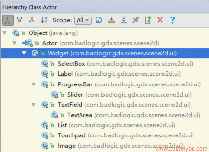
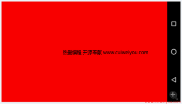
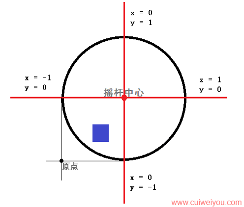
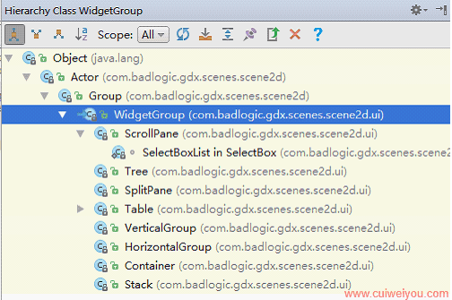
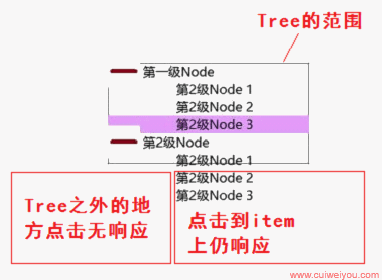
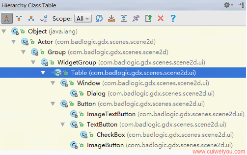
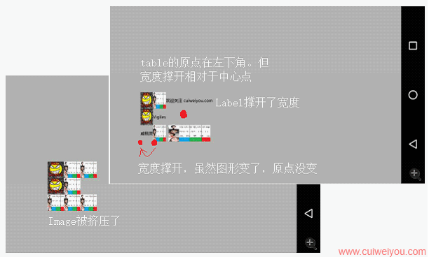

# 1.个体控件（Widget）
<br/>

## 1）图片（Image）
和Actor用起来基本一样，是Actor的进一步包装。
``` java
img = new Texture("anmi.png");

// 继承自Widget继承自Actor
Image image = new Image(new TextureRegion(img));

// 设置 image 的相关属性
image.setPosition(100, 200);
image.setScale(0.5F, 1.0F);
image.setRotation(-5);

// 添加 image 到舞台
stage.addActor(image);
```
<br/>
## 2）标签（Label）
关于fnt字体文件的创建，见后文《工具》章节。
``` java
@Override
public void create() {
    font = new BitmapFont(Gdx.files.internal("fnt.fnt")); // 使用BMFont生成得到字体说明文件。需要dispose
    Label.LabelStyle style = new Label.LabelStyle(font, Color.WHITE); // color总是黑色... 不设置则透明

    Label label = new Label("热爱编程, 开源奉献 www.cuiweiyou.com", style); // 字体文件内可用的文字
    label.setPosition(
            Gdx.graphics.getWidth() / 2 - label.getWidth() / 2,
            Gdx.graphics.getHeight() / 2 - label.getHeight() / 2);
    label.setScale(5); // 无效
    label.setFontScale(2); // 文字放大
    label.setColor(Color.WHITE); // 无效

    stage = new Stage();
    stage.addActor(label);
}
```
<br/>
可用看出字体放大原点在Label的左上角。<br/>
<br/>
## 3）文本框（TextField）
建议Android里还是老老实实用EditText吧！总之但凡输入文字，就调用Android原生处理机制为好。
``` java
@Override
public void create() {
    Pixmap pixmap = new Pixmap(Gdx.graphics.getWidth() / 2, 80, Pixmap.Format.RGBA8888);
    pixmap.setColor(1, 1, 1, 1);
    pixmap.drawRectangle(0, 0, pixmap.getWidth(), pixmap.getHeight()); // 白色边框

    img = new Texture(pixmap);
    pixmap.dispose();

    font = new BitmapFont(Gdx.files.internal("fnt.fnt"));
    TextField.TextFieldStyle style = new TextField.TextFieldStyle();
    style.background = new TextureRegionDrawable(new TextureRegion(img));
    style.font = font;
    style.fontColor = new Color(0, 0, 0, 1); // 必须设置。但都显示黑色
    style.messageFontColor = new Color(0, 0, 1, 1);

    TextField text = new TextField("", style);
    text.setSize(Gdx.graphics.getWidth() / 2, 80);
    text.setPosition(
            Gdx.graphics.getWidth() / 2 - text.getWidth() / 2,
            Gdx.graphics.getHeight() / 2 - text.getHeight() / 2);
    text.setMessageText("热爱编程"); // 只能是fnt.fnt中有的文字

    text.setTextFieldListener(new TextField.TextFieldListener() {
        @Override
        public void keyTyped(TextField textField, char c) {
            Log.e("ard", "输入：" + c); // 只能是fnt.fnt中有的文字
        }
    });

    stage = new Stage();
    stage.addActor(text);

    /**
     * 必须的
     */
    Gdx.input.setInputProcessor(stage);
}
```
<br/>
## 4）文本域（TextArea）
基本和TextField一样。但可以自动换行。但是如果输入行数超出了Area，还须自己处理滚动。
``` java
@Override
public void create() {
    Pixmap pixmap = new Pixmap(Gdx.graphics.getWidth() / 2, 120, Pixmap.Format.RGBA8888);
    pixmap.setColor(1, 1, 1, 1);
    pixmap.drawRectangle(0, 0, pixmap.getWidth(), pixmap.getHeight()); // 白色边框

    img = new Texture(pixmap);
    pixmap.dispose();

    font = new BitmapFont(Gdx.files.internal("fnt.fnt"));
    TextField.TextFieldStyle style = new TextField.TextFieldStyle();
    style.background = new TextureRegionDrawable(new TextureRegion(img));
    style.font = font;
    style.fontColor = new Color(0, 0, 0, 1); // 必须设置。但都显示黑色
    style.messageFontColor = new Color(0, 0, 1, 1);

    TextArea text = new TextArea("", style);
    text.setSize(Gdx.graphics.getWidth() / 2, 120);
    text.setPosition(
            Gdx.graphics.getWidth() / 2 - text.getWidth() / 2,
            Gdx.graphics.getHeight() - 170);
    text.setMessageText("热爱编程"); // 只能是fnt.fnt中有的文字

    text.setTextFieldListener(new TextField.TextFieldListener() {
        @Override
        public void keyTyped(TextField textField, char c) {
            Log.e("ard", "输入：" + c); // 只能是fnt.fnt中有的文字
        }
    });

    stage = new Stage();
    stage.addActor(text);

    /**
     * 必须的
     */
    Gdx.input.setInputProcessor(stage);
}
```
<br/>

## 5）列表（List）
``` java
@Override
public void create() {
    Pixmap pixmap1 = new Pixmap(Gdx.graphics.getWidth() / 2, 120, Pixmap.Format.RGBA8888);
    pixmap1.setColor(1, 1, 0, 1);
    pixmap1.fillRectangle(0, 0, pixmap1.getWidth(), pixmap1.getHeight());

    img1 = new Texture(pixmap1);
    pixmap1.dispose();

    Pixmap pixmap2 = new Pixmap(Gdx.graphics.getWidth() / 2, 120, Pixmap.Format.RGBA8888);
    pixmap2.setColor(0, 1, 1, 1);
    pixmap2.fillRectangle(0, 0, pixmap2.getWidth(), pixmap2.getHeight());

    img2 = new Texture(pixmap2);
    pixmap2.dispose();

    font = new BitmapFont(Gdx.files.internal("fnt.fnt"));
    List.ListStyle style = new List.ListStyle();
    style.selection = new TextureRegionDrawable(new TextureRegion(img1)); // 必须
    style.background = new TextureRegionDrawable(new TextureRegion(img2)); // 必须
    style.fontColorSelected = new Color(0, 0, 0, 1);
    style.fontColorUnselected = new Color(0, 0, 0, 1);
    style.font = font;

    Array<String> items = new Array<String>();
    items.add("开源");
    items.add("共享");
    items.add("探讨");
    items.add("交流");
    items.add("竞技");
    items.add("互助");
    items.add("进步");
    items.add("发展");

    final List<String> list = new List<String>(style);
    list.setItems(items);
    list.setSize(400, 200);// 如果不设大小，那么selection就不会显示，也不会响应click事件
    list.setPosition(
            Gdx.graphics.getWidth() / 2 - 200,
            Gdx.graphics.getHeight() - 220);
    list.addListener(new ClickListener() {
        @Override
        public void clicked(InputEvent event, float x, float y) {
            super.clicked(event, x, y);

            Log.e("ard", "选中项索引：" + list.getSelectedIndex()); // 始于0
            Log.e("ard", "选中项内容：" + list.getSelected());
        }

    });

    stage = new Stage();
    stage.addActor(list);

    /**
     * 必须的
     */
    Gdx.input.setInputProcessor(stage);
}
```
<br/>
## 6）进度条（ProgressBar）和滑动条（Slider）
``` java
@Override
public void create() {
    Pixmap pixmap1 = new Pixmap(50, 120, Pixmap.Format.RGBA8888);
    pixmap1.setColor(1, 1, 0, 1);
    pixmap1.fillRectangle(0, 0, pixmap1.getWidth(), pixmap1.getHeight());

    img1 = new Texture(pixmap1);

    Pixmap pixmap2 = new Pixmap(Gdx.graphics.getWidth() / 2, 120, Pixmap.Format.RGBA8888);
    pixmap2.setColor(1, 1, 1, 1);
    pixmap2.fillRectangle(0, 0, pixmap2.getWidth(), pixmap2.getHeight());

    img2 = new Texture(pixmap2);
    pixmap2.dispose();

    ProgressBar.ProgressBarStyle style1 = new ProgressBar.ProgressBarStyle();
    style1.background = new TextureRegionDrawable(new TextureRegion(img2));
    style1.knob = new TextureRegionDrawable(new TextureRegion(img1));

    final ProgressBar bar = new ProgressBar(0, 100, 1, false, style1);
    bar.setSize(800, 100);
    bar.setPosition(
            Gdx.graphics.getWidth() / 2 - 200,
            Gdx.graphics.getHeight() - 220);

    Slider.SliderStyle style2 = new Slider.SliderStyle();
    style2.background = new TextureRegionDrawable(new TextureRegion(img2));
    style2.knob = new TextureRegionDrawable(new TextureRegion(img1));

    final Slider slide = new Slider(0, 100, 1, false, style2);
    slide.setSize(800, 100);
    slide.setPosition(
            Gdx.graphics.getWidth() / 2 - 200,
            Gdx.graphics.getHeight() - 420);

    stage = new Stage();
    stage.addActor(bar);
    stage.addActor(slide);

    slide.addListener(new InputListener(){
        @Override
        public boolean touchDown(InputEvent event, float x, float y, int pointer, int button) {
            float value = slide.getValue();
            bar.setValue(value);
            
            return true;
        }

        @Override
        public void touchDragged(InputEvent event, float x, float y, int pointer) {
            super.touchDragged(event, x, y, pointer);

            float value = slide.getValue();
            bar.setValue(value);
        }
    });

    /**
     * 必须的
     */
    Gdx.input.setInputProcessor(stage);
}
```
<br/>
## 7）下拉列表（SelectBox）
相比安卓原生下拉列表，这哥确实矮矬穷了些。
``` java
@Override
public void create() {
    Pixmap pixmap1 = new Pixmap(Gdx.graphics.getWidth() / 2, 120, Pixmap.Format.RGBA8888);
    pixmap1.setColor(1, 1, 0, 1);
    pixmap1.fillRectangle(0, 0, pixmap1.getWidth(), pixmap1.getHeight());

    Texture img1 = new Texture(pixmap1);
    pixmap1.dispose();

    Pixmap pixmap2 = new Pixmap(Gdx.graphics.getWidth() / 2, 120, Pixmap.Format.RGBA8888);
    pixmap2.setColor(0, 1, 1, 1);
    pixmap2.fillRectangle(0, 0, pixmap2.getWidth(), pixmap2.getHeight());

    Texture img2 = new Texture(pixmap2);
    pixmap2.dispose();

    font = new BitmapFont(Gdx.files.internal("fnt.fnt"));

    List.ListStyle list_style = new List.ListStyle();
    list_style.font = font;
    list_style.selection = new TextureRegionDrawable(new TextureRegion(img1)); // 必须。选中的
    list_style.background = new TextureRegionDrawable(new TextureRegion(img2)); // 必须。未选的

    ScrollPane.ScrollPaneStyle scroll_style = new ScrollPane.ScrollPaneStyle();

    SelectBox.SelectBoxStyle box_style = new SelectBox.SelectBoxStyle();
    box_style.font = font; // 必须
    box_style.listStyle = list_style; // 必须
    box_style.scrollStyle = scroll_style; // 必须。就算scrollStyle什么也没设置

    Array<String> items = new Array<String>();
    items.add("111111111");
    items.add("222222222");
    items.add("333333333");
    items.add("444444444");

    final SelectBox<String> box = new SelectBox<String>(box_style);
    box.setItems(items);
    box.setSize(200, 60); // 仅是可见一行的高度。效果如Android的Spinner
    box.setPosition(
            Gdx.graphics.getWidth() / 2 - box.getWidth() / 2,
            Gdx.graphics.getHeight() / 2 - box.getHeight() / 2);

    // box.addListener得到的是列表展开前的可见item。getScrollPane才是列表
    box.getScrollPane().addListener(new ClickListener(){
        @Override
        public void clicked(InputEvent event, float x, float y) {
            super.clicked(event, x, y);
            int selectedIndex = box.getSelectedIndex();
            String selected = box.getSelected();

            Log.e("ard", "选中index：" + selectedIndex + "，内容：" + selected);
        }
    });

    stage = new Stage();
    stage.addActor(box);

    Gdx.input.setInputProcessor(stage);
}
```
<br/>
## 8）虚拟摇杆（Touchpad）
类似王者农药左下角那种前进后退的造作控件。
``` java
@Override
public void create() {
    Pixmap pixmap1 = new Pixmap(50, 50, Pixmap.Format.RGBA8888);
    pixmap1.setColor(1f, 0.6f, 0.3f, 1);
    pixmap1.fillRectangle(0, 0, pixmap1.getWidth(), pixmap1.getHeight());

    Texture img1 = new Texture(pixmap1);
    pixmap1.dispose();

    int widthAndHeight = 300;
    Pixmap pixmap2 = new Pixmap(widthAndHeight, widthAndHeight, Pixmap.Format.RGBA8888);
    pixmap2.setColor(0, 0, 0, 1);
    pixmap2.drawCircle(widthAndHeight / 2, widthAndHeight / 2, widthAndHeight / 2); // 圆心放在图形中心，半径刚好贴着图形边框

    Texture img2 = new Texture(pixmap2);
    pixmap2.dispose();

    Touchpad.TouchpadStyle pad_style = new Touchpad.TouchpadStyle();
    pad_style.knob = new TextureRegionDrawable(new TextureRegion(img1)); // 摇杆
    pad_style.background = new TextureRegionDrawable(new TextureRegion(img2)); // 背景。

    final Touchpad touchpad = new Touchpad(0f, pad_style);
    touchpad.setSize(widthAndHeight, widthAndHeight);
    touchpad.setPosition(
            Gdx.graphics.getWidth() / 2 - widthAndHeight / 2,
            Gdx.graphics.getHeight() / 2 - widthAndHeight / 2);
    touchpad.addListener(new InputListener() {
        @Override
        public boolean touchDown(InputEvent event, float x, float y, int pointer, int button) {

            return true;
        }

        @Override
        public void touchDragged(InputEvent event, float x, float y, int pointer) {
            super.touchDragged(event, x, y, pointer);

            // knob相对touchpad左下角的位置
            float knobX = touchpad.getKnobX();
            float knobY = touchpad.getKnobY();
            // knob依touchpad的中心点向右水平线，
            float knobPercentX = touchpad.getKnobPercentX(); // 手指离开中心向左趋于-1，向右趋于1
            float knobPercentY = touchpad.getKnobPercentY(); // 手指离开中心向下趋于1，向上趋于-1

            Log.e("ard", "knobX：" + knobX);
            Log.e("ard", "knobY：" + knobY);
            Log.e("ard", "knobPercentX：" + knobPercentX);
            Log.e("ard", "knobPercentY：" + knobPercentY);
        }

        @Override
        public void touchUp(InputEvent event, float x, float y, int pointer, int button) {
            super.touchUp(event, x, y, pointer, button);

        }
    });

    stage = new Stage();
    stage.addActor(touchpad);

    Gdx.input.setInputProcessor(stage);
}
```
<br/>
<br/>
# 2.群体控件（WidgetGroup）
<br/>

## 1）滚动窗格（ScrollPane）
类似Excel左侧底部带有滚动条的窗口。但需要手动指定才会出现。

``` java
@Override
public void create() {
    img = new Texture("anmi.png");

    Image image = new Image(new TextureRegion(img));
    image.setSize(500, 100); // 注意匹配图片的实际像素。实际像素可能达不到指定宽高

    ScrollPane.ScrollPaneStyle style = new ScrollPane.ScrollPaneStyle();
    style.vScroll = null; // 垂直滚动条背景条
    style.vScrollKnob = null; // 滑块
    style.hScroll = null; // 水平的
    style.hScrollKnob = null;

    ScrollPane pane = new ScrollPane(image);
    pane.setScrollingDisabled(false, true); // 只可水平滚动，不可垂直滚动
    pane.setSmoothScrolling(false);
    pane.setStyle(style);
    pane.setSize(200, 200);
    pane.setPosition(
            Gdx.graphics.getWidth() / 2 - pane.getWidth() / 2,
            Gdx.graphics.getHeight() / 2 - pane.getHeight() / 2);

    stage = new Stage();
    stage.addActor(pane);

    Gdx.input.setInputProcessor(stage);
}
```
<br/>
## 2）树（Tree）
配置各种颜色是真麻烦。有些颜色设置好像无效。
尚不确定是不是版本的问题。

``` java
@Override
public void create() {
    font = new BitmapFont(Gdx.files.internal("fnt.fnt"));
    Label.LabelStyle labelStyle = new Label.LabelStyle(font, null);
    labelStyle.fontColor = new Color(1, 1, 0, 1); // 无效...

    Pixmap pixmap1 = new Pixmap(400, 20, Pixmap.Format.RGBA8888); // 这个width要和tree的width统一才好看
    pixmap1.setColor(0.9f, 0.6f, 1f, 1);
    pixmap1.fillRectangle(0, 0, pixmap1.getWidth(), pixmap1.getHeight()); // 填充色
    img1 = new Texture(pixmap1);

    Pixmap pixmap2 = new Pixmap(400, 200, Pixmap.Format.RGBA8888); // 这个宽高要和tree的统一
    pixmap2.setColor(0, 0, 0, 1);
    pixmap2.drawRectangle(0, 0, pixmap2.getWidth(), pixmap2.getHeight()); // 边框
    img2 = new Texture(pixmap2);

    Array<Tree.Node> nodesLevel1 = new Array<>();
    nodesLevel1.add(new Tree.Node(new Label("第2级Node 1", labelStyle)));
    nodesLevel1.add(new Tree.Node(new Label("第2级Node 2", labelStyle)));
    nodesLevel1.add(new Tree.Node(new Label("第2级Node 3", labelStyle)));
    Array<Tree.Node> nodesLevel2 = new Array<>();
    nodesLevel2.add(new Tree.Node(new Label("第2级Node 1", labelStyle)));
    nodesLevel2.add(new Tree.Node(new Label("第2级Node 2", labelStyle)));
    nodesLevel2.add(new Tree.Node(new Label("第2级Node 3", labelStyle)));

    Tree.Node nodeLevel1 = new Tree.Node(new Label("第一级Node", labelStyle));
    nodeLevel1.addAll(nodesLevel1);
    Tree.Node nodeLevel2 = new Tree.Node(new Label("第2级Node", labelStyle));
    nodeLevel2.addAll(nodesLevel2);

    Tree.TreeStyle style = new Tree.TreeStyle();
    style.minus = new TextureRegionDrawable(new TextureRegion(new Texture("minus.png"))); // 必须。展开后的图标，-号
    style.plus = new TextureRegionDrawable(new TextureRegion(new Texture("plus.png"))); // 必须。折叠时的图标，+号
    style.selection = new TextureRegionDrawable(new TextureRegion(img1)); // 选中的
    style.background = new TextureRegionDrawable(new TextureRegion(img2)); // 背景

    Tree tree = new Tree(style);
    //tree.setColor(0.7f, 0, 0, 1); // 这个颜色会覆盖style.selection的颜色
    tree.add(nodeLevel1);
    tree.add(nodeLevel2);
    tree.setSize(400, 200);
    tree.setPosition(
            Gdx.graphics.getWidth() / 2 - tree.getWidth() / 2,
            Gdx.graphics.getHeight() / 2 - tree.getHeight() / 2);

    stage = new Stage();
    stage.addActor(tree);

    Gdx.input.setInputProcessor(stage);
}
```
<br/>
<br/>

## 3）拆分窗格（SplitPane）
``` java
@Override
public void create() {
    Pixmap pixmap1 = new Pixmap(500, 500, Pixmap.Format.RGBA8888);
    pixmap1.setColor(1f, 0.6f, 0.3f, 1);
    pixmap1.fillRectangle(0, 0, pixmap1.getWidth(), pixmap1.getHeight());

    Image img1 = new Image(new Texture(pixmap1));
    pixmap1.dispose();

    Pixmap pixmap2 = new Pixmap(500, 500, Pixmap.Format.RGBA8888);
    pixmap2.setColor(0, 0, 0, 1);
    pixmap2.fillRectangle(0, 0, pixmap1.getWidth(), pixmap1.getHeight());

    Image img2 = new Image(new Texture(pixmap2));
    pixmap2.dispose();

    SplitPane.SplitPaneStyle style = new SplitPane.SplitPaneStyle();
    // 分割条。这张Drawable在两个Actor之间，挤占了每个Actor的空间。建议只有1-2像素即可。
    style.handle = new TextureRegionDrawable(new TextureRegion(new Texture("badlogic.jpg"))); //

    SplitPane pane = new SplitPane(img1, img2, false, style); // 2个actor，方向 true垂直滚动 false水平滚动，风格
    pane.setColor(1, 0, 0, 1); // 背景色
    pane.setSize(400, 400);
    pane.setPosition(
            Gdx.graphics.getWidth() / 2 - pane.getWidth() / 2,
            Gdx.graphics.getHeight() / 2 - pane.getHeight() / 2);

    stage = new Stage();
    stage.addActor(pane);

    Gdx.input.setInputProcessor(stage);
}

```
<br/>

## 4）垂直组合（VerticalGroup）和水平组合（HorizontalGroup）

``` java
@Override
public void create() {
    img1 = new Image(new Texture("badlogic.jpg"));
    img2 = new Image(new Texture("anmi.png"));
    img3 = new Image(new Texture("badlogic.jpg"));
    img4 = new Image(new Texture("anmi.png"));

    VerticalGroup group0 = new VerticalGroup();
    group0.addActor(img1);
    group0.addActor(img2);
    group0.setColor(1, 0, 0, 1);
    group0.setPosition(128, 512);

    HorizontalGroup group = new HorizontalGroup();
    group.addActor(img3);
    group.addActor(img4);
    group.setColor(1, 1, 0, 1);
    group.setPosition(256, 256);

    stage = new Stage();
    stage.addActor(group0);
    stage.addActor(group);

    Gdx.input.setInputProcessor(stage);
}

```
<br/>

## 5）容器（Container）
只有一个子元素的组，更轻便。

``` java
@Override
public void create() {
    img1 = new Image(new Texture("badlogic.jpg"));
    img2 = new Image(new Texture("anmi.png"));
    img3 = new Image(new Texture("badlogic.jpg"));
    img4 = new Image(new Texture("anmi.png"));

    Container container = new Container();
    container.setActor(img1);
    container.setColor(1, 1, 0, 1);
    container.setSize(300, 300);
    container.setPosition(256, 256);

    stage = new Stage();
    stage.addActor(container);

    Gdx.input.setInputProcessor(stage);
}

```
<br/>

## 6）堆（Stack）

最后放入的遮挡先放入的。
``` java
@Override
public void create() {
    img1 = new Image(new Texture("badlogic.jpg"));
    img2 = new Image(new Texture("anmi.png"));
    img3 = new Image(new Texture("badlogic.jpg"));
    img4 = new Image(new Texture("anmi.png"));

    Stack stack = new Stack();
    stack.addActor(img1);
    stack.addActor(img2);
    stack.addActor(img3);
    stack.addActor(img4);
    stack.setColor(1, 1, 0, 1);
    stack.setSize(300, 300);
    stack.setPosition(256, 256);
    stack.swapActor(2,3); // 交换2个位置上的actor。最后位置的被显示

    stage = new Stage();
    stage.addActor(stack);

    Gdx.input.setInputProcessor(stage);
}

```
<br/>

# 3.复合控件/表格（Table）

<br/>

``` java
@Override
public void create() {
    img1 = new Image(new Texture("badlogic.jpg"));
    img2 = new Image(new Texture("anmi.png"));
    img3 = new Image(new Texture("badlogic.jpg"));
    img4 = new Image(new Texture("anmi.png"));

    Label.LabelStyle labelStyle = new Label.LabelStyle(new BitmapFont(Gdx.files.internal("fnt.fnt")), Color.WHITE);

    Skin skin = new Skin();
    skin.add("default", labelStyle);

    Table table = new Table(skin);
    table.add(img1);
    table.add(img2);
    table.add("欢迎关注 cuiweiyou.com"); // 添加字符串前必须指定skin

    table.row(); // 新建一行
    table.add(img3); // 在新的行里插入列
    table.add("Vigiles");
    // 默认从最左边插入，少了就空出右边的cell

    table.row();
    table.add("威格灵");
    table.add(new Image(new Texture("anmi.png")));
    table.add(new Image(new Texture("anmi.png")));

    table.setColor(1, 1, 0, 1);
    table.setSize(300, 300); // 如果cell里全是image，则会挤压全部image。有Label，则文字会撑开cell
    //table.setPosition(256, 256);

    stage = new Stage();
    stage.addActor(table);

    Gdx.input.setInputProcessor(stage);
}
```
<br/>
<br/>

## 1）窗体（Window）
基本和Table用法一样。

``` java
    @Override
    public void create() {
        int width = 600, height = 600;
        Pixmap pixmap = new Pixmap(width, height, Pixmap.Format.RGBA8888);
        pixmap.setColor(1, 1, 1, 1);
        pixmap.fillRectangle(0, 0, width, height);

        font = new BitmapFont(Gdx.files.internal("fnt.fnt"));

        img1 = new Image(new Texture("badlogic.jpg"));
        img2 = new Image(new Texture("anmi.png"));
        img3 = new Image(new Texture("badlogic.jpg"));
        img4 = new Image(new Texture("anmi.png"));

        img1.setSize(30, 30);
        img2.setSize(30, 30);
        img3.setSize(30, 30);

        img1.setPosition(10, 10);
        img2.setPosition(50, 10);
        img3.setPosition(70, 10);

        Label.LabelStyle labelStyle = new Label.LabelStyle(new BitmapFont(Gdx.files.internal("fnt.fnt")), Color.WHITE);

        Window.WindowStyle style = new Window.WindowStyle();
        style.titleFont = font;
        style.titleFontColor = new Color(1, 0, 0, 1);
        style.background = new TextureRegionDrawable(new TextureRegion(new Texture(pixmap)));
        pixmap.dispose();

        Skin skin = new Skin();
        skin.add("default", style); // key不能重复。default为Window自己使用
        skin.add("labelStyle", labelStyle);

        Window window = new Window("GDX指北", skin); // 继承自table哎
        window.add(img1);
        window.add(img2);
        window.add("欢迎关注 cuiweiyou.com", "labelStyle"); // 添加字符串前必须指定skin
//
        window.row(); // 默认只在一行里添加，多了就挤压。新建一行
        window.add(img3); // 在新的行里插入列
        window.add("Vigiles", "labelStyle");
        // 默认从最左边插入，少了就空出右边的cell

        window.row();
        window.add("威格灵", "labelStyle");
        window.add(new Image(new Texture("anmi.png")));
        window.add(new Image(new Texture("anmi.png")));

        window.setColor(1, 1, 1, 1); // 这个会覆盖background的color
        window.setSize(width, height); // 如果子元素全是image，则会平均挤压全部image。有Label，保证文字宽高，挤压图片
        window.setMovable(true);
        window.setPosition(256, 256);

        stage = new Stage();
        stage.addActor(window);

        Gdx.input.setInputProcessor(stage);
    }

```
<br/>

## 2）按钮（Button）

``` java
@Override
public void create() {
    Button.ButtonStyle style = new Button.ButtonStyle();
    style.up = new TextureRegionDrawable(new TextureRegion(new Texture("plus.png")));
    style.down = new TextureRegionDrawable(new TextureRegion(new Texture("minus.png")));

    Button button = new Button(style);
    button.setSize(300, 60);
    button.setPosition(600, 400);

    button.addListener(new ClickListener(){
        @Override
        public void clicked(InputEvent event, float x, float y) {
            super.clicked(event, x, y);
            Log.e("ard", "点击了");
        }
    });

    stage = new Stage();
    stage.addActor(button);

    Gdx.input.setInputProcessor(stage);
}

```
<br/>

## 3）弹窗（Dialog）

``` java
@Override
public void create() {
    Pixmap pixmap = new Pixmap(600, 600, Pixmap.Format.RGBA8888);
    pixmap.setColor(1, 1, 1, 1);
    pixmap.fillRectangle(0, 0, 600, 600);

    font = new BitmapFont(Gdx.files.internal("fnt.fnt"));

    Window.WindowStyle windowStyle = new Window.WindowStyle();
    windowStyle.titleFont = font;
    windowStyle.background = new TextureRegionDrawable(new TextureRegion(new Texture(pixmap)));
    pixmap.dispose();

    Label.LabelStyle labelStyle = new Label.LabelStyle();
    labelStyle.font = font;

    TextButton.TextButtonStyle buttonStyle = new TextButton.TextButtonStyle();
    buttonStyle.font = font;

    final Dialog dialog = new Dialog("弹窗", windowStyle);
    dialog.setPosition(Gdx.graphics.getWidth() / 2, Gdx.graphics.getHeight() / 2);
    dialog.text("这里是内容", labelStyle);
    dialog.button("OK", true, buttonStyle) // 即使不添加事件，默认点击就消失
            .addListener(new ClickListener() {
                @Override
                public void clicked(InputEvent event, float x, float y) {
                    super.clicked(event, x, y);
                    Log.e("ard","关闭弹窗");
                }
            });
    dialog.setVisible(false); // 先隐藏

    Button.ButtonStyle style = new Button.ButtonStyle();
    style.up = new TextureRegionDrawable(new TextureRegion(new Texture("plus.png")));
    style.down = new TextureRegionDrawable(new TextureRegion(new Texture("minus.png")));
    Button button = new Button(style);
    button.setSize(300, 60);
    button.setPosition(600, 400);
    button.addListener(new ClickListener() {
        @Override
        public void clicked(InputEvent event, float x, float y) {
            super.clicked(event, x, y);
            dialog.setVisible(true);
        }
    });

    stage = new Stage();
    stage.addActor(button);
    stage.addActor(dialog);

    Gdx.input.setInputProcessor(stage);
}

```
<br/>

## 4）图文按钮（ImageTextButton）
不见得好用，就是左右排列图片文本。
``` java
ImageTextButton button = new ImageTextButton("点我", style);
button.setColor(1, 0, 0, 1);
button.setSize(300, 60);
button.setPosition(600, 400);
button.addListener(new ClickListener() {
    @Override
    public void clicked(InputEvent event, float x, float y) {
        super.clicked(event, x, y);
        //做点什么
    }
});

```
<br/>

## 5）文本按钮（TextButton）

``` java
TextButton.TextButtonStyle style = new TextButton.TextButtonStyle();
style.font = font; // 字体

TextButton button = new TextButton("点我", style);
button.setSize(300, 60);
button.setPosition(600, 400);
button.addListener(new ClickListener() {
    @Override
    public void clicked(InputEvent event, float x, float y) {
        super.clicked(event, x, y);
        //做点什么
    }
});

```
<br/>

## 6）复选框（CheckBox）

``` java
CheckBox.CheckBoxStyle style = new CheckBox.CheckBoxStyle();
style.font = font;
style.checkboxOff = new TextureRegionDrawable(new TextureRegion(new Texture("minus.png"))); // 未选中
style.checkboxOn = new TextureRegionDrawable(new TextureRegion(new Texture("plus.png"))); // 选中

CheckBox box = new CheckBox("选我", style);
box.setSize(300, 60);
box.setPosition(600, 400);
box.addListener(new ClickListener() {
    @Override
    public void clicked(InputEvent event, float x, float y) {
        super.clicked(event, x, y);
        //做点什么
        dialog.setVisible(true);
    }
});

```
<br/>

## 7）图片按钮（ImageButton）
和Button一样。
``` java
ImageButton.ImageButtonStyle style = new ImageButton.ImageButtonStyle();
style.imageUp = new TextureRegionDrawable(new TextureRegion(new Texture("minus.png"))); // 未选中
style.imageDown = new TextureRegionDrawable(new TextureRegion(new Texture("plus.png"))); // 选中

ImageButton button = new ImageButton(style);
button.setSize(300, 60);
button.setPosition(600, 400);
button.addListener(new ClickListener() {
    @Override
    public void clicked(InputEvent event, float x, float y) {
        super.clicked(event, x, y);
        //做点什么
    }
});
```
<br/>

